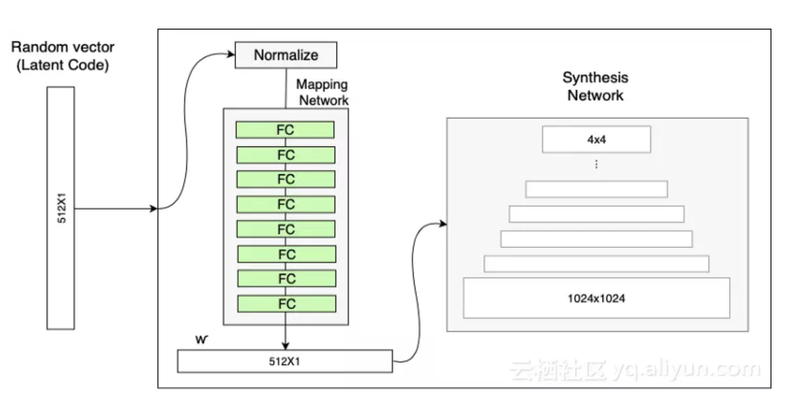

# A Style-Based Generator Achitecture for Generative Adversarial Networks
文章地址：[styleGAN](https://arxiv.org/pdf/1812.04948.pdf) 
## motivation
- 过去GAN在生成高分辨率图像上是很困难的。[ProGAN](https://arxiv.org/pdf/1710.10196.pdf)的提出使生成1024x1024的图片成为的可能。但是ProGAN有很大的缺点：轻微改变输入可能会很大程度上影响多个高阶特征。
- styleGAN最大的特点就是可以通过修改网络中每个级别的输入来控制该级别的视觉特征。粗糙特征（姿势、面部表情）到精细特征（头发颜色）
## 成果
- 一个收到stle transfer启发的可以控制高层feature和有随机的low-level feature 的生成器
- 两种更加量化的特征分离的方法
- 高分辨率人脸数据集[FFHQ（Flickr-Faces-HQ）](https://github.com/NVlabs/ffhq-dataset)
## style-based generator 主要构成
### 映射网络
- 原因：直接输入latent code来控制视觉特征效果有限，因为输入向量空间会被映射到视觉特征空间。而这个映射过程取决于训练集的概率密度，越多的特征越有可能被映射到。如：某个训练集是70%黑人，30%白人，那么后期随机输入一个向量时候生成黑人的图片会多于白人。特征纠缠，改变一个latent code的值会改变很多high-level的特征。
- 结构：8个全连接层，输入输出一样均为512x1，输出的w'会加到
sytnthesis网络中。

### 样式适应模块(AdaIN)
>$$AdaIN(x_i, y)=y_{s,i}\frac{x_i-\mu(x_i)}{\sigma(x_i)}+y_{b,i}$$
输入的w'会再一次经过一个全连接层生成scale和bia向量从而定义每个卷积通道的重要性，其中i就表示卷积通道i

### 合成网络(Synthesis Network)
- constant 输入4x4x512相比之下ProGAN是随机输入。原因：首先，w'和AdaIN已经能很好的控制特征了。其次，随机输入会造成特征纠缠（见映射网络）运用w'和AdaIN的目的就是为了避免。

## 随机噪声
- 为了使生成图片多样性，一些缩放之后的随机噪声会加在AdaIN之前，轻微改变特征，使生成的图片多样性。

## style-based generator的一些特征
### style mixing
### 随机变换(stochastic variation)
## 特征分离 disentanglement
特征分离的最终目标都是希望有一个线性子空间，其中每一个值控制一个factor，而不是影响多个因素。但现实是如果直接用sample的Z最终网络回去对应数据集的分布。
- 感知路径长度（perceptual path length）
通过在latent-space中的向量之间插值，可以生成在endpoint不会出现的特征，这说明latent-space是entangled（不分离的）即变化的因素没有合适的分开
- 线性分离(linear separability)
## 一些额外的知识
### 评价GAN生成图片的质量：IS, FID
